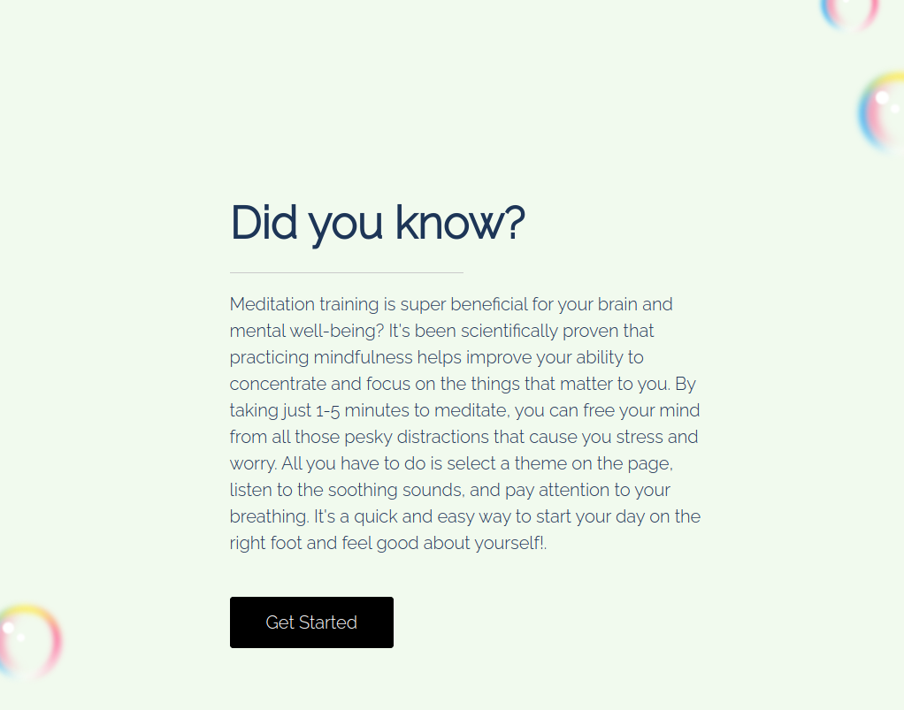
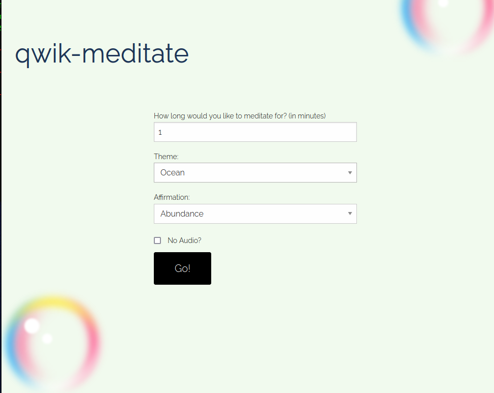
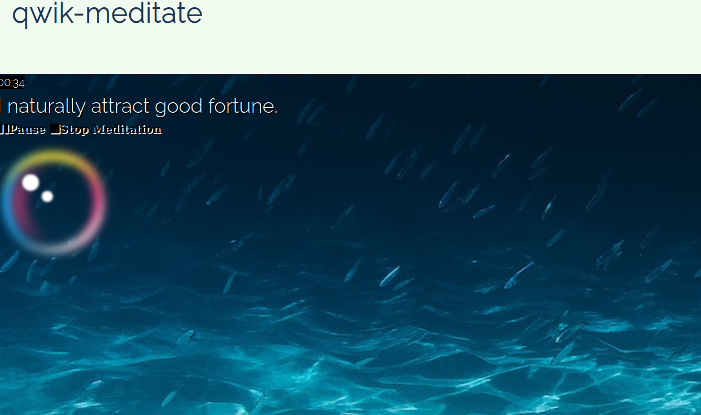

# Qwik-meditate

## Description

The Qwik-meditate web-app lets you make your own meditation session super easy! You can pick how long you want to meditate and then choose from a bunch of cool affirmations and themes for your eyes and ears. Site Can be visited on Mobile, web and VR.
## How to use

- Visit web url --> https://jefftrojan.github.io/qwik-mdt/

- No need for authentication yet

- Click on Get Started

- Select the theme you want and the type of affirmation you want to hear

- You can also choose to disable audio or allow audio by using the little check box 

- Once you click on Go, it takes you the meditation page with randomly generated images and sound

- The page contains audio visuals and you can pause/play and stop by using the respective buttons on the page

## Future release

- User accounts and data tracking - Allow users to create accounts to save their meditation preferences and track their progress over time.

- Guided meditations - Offer a library of guided meditations from experienced practitioners to help users deepen their practice.

- Community features - Enable users to connect with other meditators, share their experiences, and offer support and encouragement to one another.

- Personalized recommendations - Use machine learning algorithms to analyze a user's meditation preferences and suggest new affirmations, themes, and guided meditations that are likely to resonate with them.

- Mobile app - Create a mobile version of the website that can be accessed on the go, with additional features such as reminders to meditate and real-time tracking of meditation progress.

_________________________________

Copyright (c) 2023, Jeffrey Dauda
